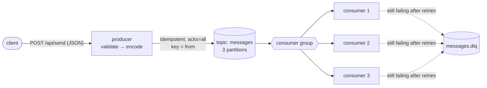

<div align="center">

# good-gokafka

**A production-minded Kafka producer & consumer in Go. Clone it, run one command, read about 1,300 lines of Go.**

[](https://github.com/tomdong2010/good-gokafka/actions/workflows/ci.yml)
[](https://goreportcard.com/report/github.com/tomdong2010/good-gokafka)
[](go.mod)
[](docker-compose.yml)
[](https://github.com/tomdong2010/good-gokafka/releases)
[](LICENSE)

English | [简体中文](README.zh-CN.md)

</div>

Most Kafka examples stop at "hello world": a consumer glued to partition 0, no retries,
`panic` on a bad message. **good-gokafka** is still small enough to read in one sitting,
but it shows how to do the parts that matter in production, with a test for each one:

| | What you get | Where |
|---|---|---|
| ✅ | **Idempotent producer**: `acks=all`, retries without duplicates, snappy compression | [`internal/kafka`](internal/kafka/config.go) |
| ✅ | **Keyed ordering**: messages from one sender always land on the same partition | [`producer/handler`](producer/handler/http.go) |
| ✅ | **Consumer groups**: scale out with `--scale consumer=3`, sticky rebalancing | [`consumer/sub`](consumer/sub/kafka.go) |
| ✅ | **At-least-once**: offsets committed only after a record is handled | [`consumer/sub`](consumer/sub/kafka.go) |
| ✅ | **Retry + dead-letter queue**: exponential backoff, poison records go to `<topic>.dlq` with their origin in headers | [`consumer/sub/retry.go`](consumer/sub/retry.go) |
| ✅ | **Protobuf or JSON**, chosen per record through a `content-type` header | [`internal/message`](internal/message/message.go) |
| ✅ | **Validated HTTP API** with request limits and meaningful status codes | [`producer/handler`](producer/handler/http.go) |
| ✅ | **Graceful shutdown**: drain HTTP requests, flush the producer, commit offsets | [`producer/main.go`](producer/main.go) |
| ✅ | **Prometheus metrics + Grafana dashboard**: throughput, publish latency, per-partition lag, retries, DLQ | [`consumer/sub/metrics.go`](consumer/sub/metrics.go) |
| ✅ | **TLS, mTLS and SASL** (PLAIN, SCRAM-SHA-256/512) for Confluent Cloud, Amazon MSK and similar services | [`internal/kafka/security.go`](internal/kafka/security.go) |
| ✅ | **12-factor config** and structured `slog` logs (text or JSON) | [`internal/config`](internal/config/config.go) |
| ✅ | **Tests**: unit tests with `-race`, plus integration tests against a real broker in CI | [`integration`](integration/e2e_test.go) |
| ✅ | **Tiny distroless images** (~5 MB compressed) and a Docker Compose demo that runs without ZooKeeper | [`Dockerfile`](Dockerfile) |

## Architecture



<p align="center">
  
  <br><sub>The bundled Grafana dashboard (<code>make monitoring load</code>) with 3 consumers and 30% simulated failures.</sub>
</p>

## Quick start

All you need is Docker.

```shell
git clone https://github.com/tomdong2010/good-gokafka && cd good-gokafka
make demo    # Kafka (KRaft) + producer + 3 consumers
make send    # or use the curl command below
```

```shell
curl -X POST http://localhost:3000/api/send \
  -H 'content-type: application/json' \
  -d '{"from": "gopher", "content": {"header": "Hi", "body": "Hello Kafka"}}'
# {"message":"message sent","partition":1,"offset":0}

docker compose logs -f consumer
```

Things to try:

- **Watch a rebalance.** Run `docker compose up -d --scale consumer=1`, then `=3`. The log line
  `partitions assigned` shows how the 3 partitions get split between the consumers.
- **Send a poison record.** Push a record the consumer cannot decode, then read it back from the dead-letter topic:
  ```shell
  docker compose exec kafka bash -c 'echo garbage | /opt/kafka/bin/kafka-console-producer.sh --bootstrap-server localhost:9092 --topic messages'
  docker compose exec kafka /opt/kafka/bin/kafka-console-consumer.sh --bootstrap-server localhost:9092 \
    --topic messages.dlq --from-beginning --property print.headers=true
  # x-original-topic:messages,x-original-partition:0,x-original-offset:3,x-error:decode proto: ...	garbage
  ```
- **Watch it in Grafana.** `make monitoring load` starts Prometheus and Grafana and makes 30% of records fail
  on their first attempts. Open http://localhost:3001 to see the retries, the dead-letter count and
  the per-partition lag. Metrics are also exposed directly on `:3000/metrics` (producer) and `:9100/metrics` (consumer).
- **Open the Kafka web UI.** `docker compose --profile ui up -d`, then browse to http://localhost:8080.
- **Tear it all down.** `make down`

### Prebuilt binaries and images

Each [release](https://github.com/tomdong2010/good-gokafka/releases) ships binaries for Linux, macOS and Windows
(amd64 and arm64) and multi-arch images:

```shell
docker pull ghcr.io/tomdong2010/good-gokafka-producer:latest
docker pull ghcr.io/tomdong2010/good-gokafka-consumer:latest
```

### Running from source

```shell
make up                                 # Kafka only, on localhost:9092
(cd producer && go run .)               # reads producer/.env
(cd consumer && go run .)               # reads consumer/.env
make test                               # unit tests
make integration                        # integration tests against the Kafka container
```

## HTTP API

| Method & path | Description |
|---|---|
| `POST /api/send` | Body `{"from": string, "content": {"header": string, "body": string}}`. `from` and `content.body` are required. |
| `GET /healthz` | Liveness probe. |
| `GET /metrics` | Prometheus metrics. |

Status codes: `200` sent (the response includes the partition and offset) · `400` malformed JSON or unknown field ·
`413` body over 1 MiB · `422` failed validation · `502` Kafka unavailable.

## Configuration

Settings come from environment variables. A `.env` file in the working directory is loaded if present,
and variables already set in the environment take precedence.

| Variable | Service | Default | Description |
|---|---|---|---|
| `KAFKA_BROKERS` | both | – | Comma separated bootstrap servers (`KAFKA_ADDRESS` / `ZOOKEEPER_HOST` are still accepted) |
| `KAFKA_TOPIC` | both | – | Topic to publish to; the consumer accepts a comma separated list |
| `MESSAGE_FORMAT` | both | `proto` | `proto` or `json`; the consumer uses it only for records without a `content-type` header |
| `KAFKA_CLIENT_ID` | both | `good-gokafka-*` | Kafka client ID |
| `LOG_LEVEL` / `LOG_FORMAT` | both | `info` / `text` | `debug`…`error` / `text` or `json` |
| `HTTP_ADDR` | producer | `:3000` | HTTP listen address |
| `SHUTDOWN_TIMEOUT` | producer | `10s` | Time allowed for in-flight requests on shutdown |
| `KAFKA_GROUP_ID` | consumer | `good-gokafka-consumer` | Consumer group ID |
| `MAX_RETRIES` | consumer | `3` | Extra attempts for a failing record (decode errors are not retried) |
| `RETRY_BACKOFF` | consumer | `200ms` | First retry delay; doubles on each attempt, capped at 30s |
| `DLQ_ENABLED` | consumer | `true` | Send records that still fail to a dead-letter topic; if `false`, they are logged and skipped |
| `DLQ_SUFFIX` | consumer | `.dlq` | Dead-letter topic name is the original topic plus this suffix |
| `METRICS_ADDR` | consumer | `:9100` | Address serving `/metrics` and `/healthz` (the producer serves them on `HTTP_ADDR`) |
| `SIMULATE_FAILURE_RATE` | consumer | `0` | Demo only: fraction of handler calls that fail transiently, to exercise retries and the DLQ |
| `KAFKA_TLS_ENABLED` | both | `false` | Connect over TLS, trusting the system roots |
| `KAFKA_TLS_CA_FILE` | both | – | PEM bundle to trust instead (enables TLS) |
| `KAFKA_TLS_CERT_FILE` / `KAFKA_TLS_KEY_FILE` | both | – | Client certificate and key for mutual TLS |
| `KAFKA_SASL_MECHANISM` | both | – | `PLAIN`, `SCRAM-SHA-256` or `SCRAM-SHA-512` |
| `KAFKA_SASL_USERNAME` / `KAFKA_SASL_PASSWORD` | both | – | SASL credentials |

## Design notes

<details>
<summary><b>Why an idempotent producer?</b></summary>

With plain retries, a lost acknowledgement makes the producer send the record again, which writes a duplicate.
With `Producer.Idempotent = true`, the broker drops those duplicates using producer IDs and sequence numbers.
This requires `acks=all` and `Net.MaxOpenRequests = 1` in sarama. [`internal/kafka`](internal/kafka/config_test.go)
has a test that fails if the config ever becomes invalid.
</details>

<details>
<summary><b>What happens when a record fails?</b></summary>

1. The handler is retried up to `MAX_RETRIES` times with exponential backoff, unless it returned
   `sub.Permanent(err)` (a malformed record is never going to decode).
2. If it still fails, the record goes to `<topic>.dlq` with its key, value and headers unchanged, plus
   `x-original-topic`, `x-original-partition`, `x-original-offset` and `x-error` headers.
3. If the dead-letter topic cannot be written either, the consumer keeps retrying and holds the partition
   rather than losing the record. On shutdown the record stays uncommitted, so it is delivered again.

The offset is committed only after one of these steps succeeds, which gives **at-least-once** delivery.
Handlers should therefore be idempotent.
</details>

<details>
<summary><b>Which metrics are exported?</b></summary>

| Metric | Labels | Meaning |
|---|---|---|
| `gokafka_producer_messages_total` | `topic`, `result` = sent / invalid / failed | API messages by outcome |
| `gokafka_producer_publish_duration_seconds` | `topic` | Time until the broker acknowledges a record |
| `gokafka_producer_http_requests_total` | `handler`, `method`, `code` | HTTP requests |
| `gokafka_consumer_records_total` | `topic`, `result` = ok / dead_letter / skipped | Records by outcome |
| `gokafka_consumer_retries_total` | `topic` | Retries after a transient error |
| `gokafka_consumer_dead_letter_errors_total` | `topic` | Failed writes to the dead-letter topic |
| `gokafka_consumer_processing_duration_seconds` | `topic` | Time per record, including retries |
| `gokafka_consumer_lag` | `topic`, `partition` | Records left before the partition's high watermark |

Every series for a topic is created at zero up front, so `rate()` and `histogram_quantile()` return a value
before the first event. Prometheus finds scaled consumers through Docker DNS
([`deploy/prometheus`](deploy/prometheus/prometheus.yml)), and the dashboard is provisioned from
[`deploy/grafana`](deploy/grafana/dashboards/good-gokafka.json).
</details>

<details>
<summary><b>Why no ZooKeeper?</b></summary>

Kafka has run in KRaft mode (without ZooKeeper) in production since 3.3, and ZooKeeper support was removed in Kafka 4.0.
The compose file runs a single KRaft node with an internal listener for the containers (`kafka:19092`)
and a host listener for `go run` and the tests (`localhost:9092`).
</details>

## Project layout

```
producer/            HTTP API → Kafka           (main, handler, pub)
consumer/            consumer group → handler   (main, handler, sub: retry + DLQ)
internal/message     Message type, validation, protobuf/JSON codecs (+ .proto)
internal/kafka       sarama producer / consumer configuration, TLS & SASL
internal/metrics     Prometheus registry and /metrics handler
internal/config      environment, .env and logger setup
integration/         tests against a real broker (go test -tags integration)
deploy/              Prometheus scrape config, Grafana datasource + dashboard
scripts/load.sh      load generator for the dashboard
```

## Roadmap

- [x] Prometheus metrics and a Grafana dashboard
- [x] TLS, mTLS and SASL (PLAIN, SCRAM) configuration
- [ ] OpenTelemetry trace propagation through record headers
- [ ] Batch / async producer example
- [ ] DLQ replay tool

Ideas and PRs are welcome. See [CONTRIBUTING.md](CONTRIBUTING.md).

## License

[MIT](LICENSE). Release notes are in [CHANGELOG.md](CHANGELOG.md).

## Acknowledgements

Originally based on [wuriyanto48/go-kafka-demo](https://github.com/wuriyanto48/go-kafka-demo).
Built on [IBM/sarama](https://github.com/IBM/sarama).

---

<div align="center">

If this project helped you understand Kafka in Go, consider giving it a ⭐. It helps others find it.

</div>
