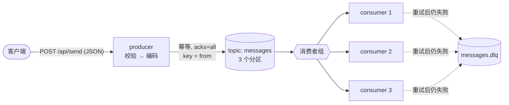
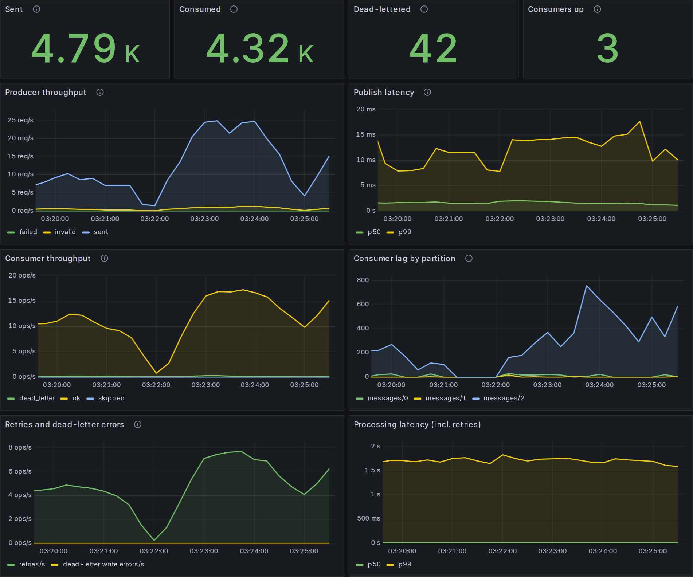

<div align="center">

# good-gokafka

**面向生产实践的 Go Kafka 生产者 / 消费者示例：克隆下来，一条命令就能跑起来，Go 代码约 1300 行。**

[](https://github.com/tomdong2010/good-gokafka/actions/workflows/ci.yml)
[](https://goreportcard.com/report/github.com/tomdong2010/good-gokafka)
[](go.mod)
[](docker-compose.yml)

[English](README.md) | 简体中文

</div>

大多数 Kafka 示例只做到 "hello world"：消费者写死 partition 0、没有重试，遇到坏消息直接 `panic`。
**good-gokafka** 依然小到可以一口气读完，但把生产环境里真正要处理的部分都做了，并且每一项都有测试：

| | 特性 | 代码位置 |
|---|---|---|
| ✅ | **幂等生产者**：`acks=all`，重试不产生重复消息，snappy 压缩 | [`internal/kafka`](internal/kafka/config.go) |
| ✅ | **按 key 保序**：同一发送者的消息始终写入同一分区 | [`producer/handler`](producer/handler/http.go) |
| ✅ | **消费者组**：`--scale consumer=3` 即可水平扩展，使用 sticky 分区分配策略 | [`consumer/sub`](consumer/sub/kafka.go) |
| ✅ | **至少一次（at-least-once）**：消息处理完成后才提交 offset | [`consumer/sub`](consumer/sub/kafka.go) |
| ✅ | **重试 + 死信队列**：指数退避；无法处理的消息进入 `<topic>.dlq`，并在 header 中记录来源 | [`consumer/sub/retry.go`](consumer/sub/retry.go) |
| ✅ | **Protobuf / JSON 双编码**：按每条消息的 `content-type` header 自动识别 | [`internal/message`](internal/message/message.go) |
| ✅ | **带校验的 HTTP API**：限制请求体大小，返回语义明确的状态码 | [`producer/handler`](producer/handler/http.go) |
| ✅ | **优雅退出**：处理完进行中的 HTTP 请求，flush 生产者，提交 offset | [`producer/main.go`](producer/main.go) |
| ✅ | **Prometheus 指标 + Grafana 看板**：吞吐量、发送延迟、各分区消费延迟（lag）、重试、死信 | [`consumer/sub/metrics.go`](consumer/sub/metrics.go) |
| ✅ | **TLS、mTLS 与 SASL**（PLAIN、SCRAM-SHA-256/512），可直接连接 Confluent Cloud、Amazon MSK 等托管服务 | [`internal/kafka/security.go`](internal/kafka/security.go) |
| ✅ | **12-factor 配置**，`slog` 结构化日志（text / JSON） | [`internal/config`](internal/config/config.go) |
| ✅ | **测试**：单元测试开启 `-race`，CI 中还会连真实 Kafka 跑集成测试 | [`integration`](integration/e2e_test.go) |
| ✅ | **精简的 distroless 镜像**（压缩后约 5 MB），Docker Compose 演示环境不需要 ZooKeeper | [`Dockerfile`](Dockerfile) |

## 架构



<p align="center">
  
  <br><sub>自带的 Grafana 看板（<code>make monitoring load</code>），3 个消费者，模拟 30% 处理失败。</sub>
</p>

## 快速开始

只需要安装 Docker。

```shell
git clone https://github.com/tomdong2010/good-gokafka && cd good-gokafka
make demo    # 启动 Kafka (KRaft) + producer + 3 个 consumer
make send    # 或者用下面的 curl 命令
```

```shell
curl -X POST http://localhost:3000/api/send \
  -H 'content-type: application/json' \
  -d '{"from": "gopher", "content": {"header": "Hi", "body": "Hello Kafka"}}'
# {"message":"message sent","partition":1,"offset":0}

docker compose logs -f consumer
```

可以试试这些：

- **观察 rebalance**：先 `docker compose up -d --scale consumer=1`，再改成 `=3`。日志里的
  `partitions assigned` 会显示 3 个分区如何分配给各个消费者。
- **发送一条坏消息**：写入一条消费者无法解码的消息，然后从死信 topic 里读出来：
  ```shell
  docker compose exec kafka bash -c 'echo garbage | /opt/kafka/bin/kafka-console-producer.sh --bootstrap-server localhost:9092 --topic messages'
  docker compose exec kafka /opt/kafka/bin/kafka-console-consumer.sh --bootstrap-server localhost:9092 \
    --topic messages.dlq --from-beginning --property print.headers=true
  # x-original-topic:messages,x-original-partition:0,x-original-offset:3,x-error:decode proto: ...	garbage
  ```
- **在 Grafana 中观察**：`make monitoring load` 会启动 Prometheus 和 Grafana，并让 30% 的消息在首次处理时失败。
  打开 http://localhost:3001 可以看到重试、死信数量和各分区的消费延迟。指标也可以直接访问：
  producer 在 `:3000/metrics`，consumer 在 `:9100/metrics`。
- **打开 Kafka Web UI**：`docker compose --profile ui up -d`，然后访问 http://localhost:8080
- **全部清理**：`make down`

### 从源码运行

```shell
make up                                 # 只启动 Kafka，监听 localhost:9092
(cd producer && go run .)               # 读取 producer/.env
(cd consumer && go run .)               # 读取 consumer/.env
make test                               # 单元测试
make integration                        # 连接 Kafka 容器运行集成测试
```

## HTTP API

| 方法与路径 | 说明 |
|---|---|
| `POST /api/send` | 请求体 `{"from": string, "content": {"header": string, "body": string}}`，其中 `from` 和 `content.body` 必填 |
| `GET /healthz` | 存活探针 |
| `GET /metrics` | Prometheus 指标 |

状态码：`200` 发送成功（返回 partition 和 offset）· `400` JSON 格式错误或包含未知字段 · `413` 请求体超过 1 MiB ·
`422` 校验失败 · `502` Kafka 不可用。

## 配置

配置来自环境变量。工作目录下如果有 `.env` 文件会自动加载，已设置的环境变量优先。

| 变量 | 服务 | 默认值 | 说明 |
|---|---|---|---|
| `KAFKA_BROKERS` | 两者 | – | 逗号分隔的 broker 地址（仍兼容 `KAFKA_ADDRESS` / `ZOOKEEPER_HOST`） |
| `KAFKA_TOPIC` | 两者 | – | 要发送到的 topic；消费者可填写逗号分隔的多个 topic |
| `MESSAGE_FORMAT` | 两者 | `proto` | `proto` 或 `json`；消费者只在消息没有 `content-type` header 时使用它 |
| `KAFKA_CLIENT_ID` | 两者 | `good-gokafka-*` | Kafka client ID |
| `LOG_LEVEL` / `LOG_FORMAT` | 两者 | `info` / `text` | `debug`…`error` / `text` 或 `json` |
| `HTTP_ADDR` | producer | `:3000` | HTTP 监听地址 |
| `SHUTDOWN_TIMEOUT` | producer | `10s` | 退出时等待进行中请求的最长时间 |
| `KAFKA_GROUP_ID` | consumer | `good-gokafka-consumer` | 消费者组 ID |
| `MAX_RETRIES` | consumer | `3` | 处理失败时的额外重试次数（解码错误不重试） |
| `RETRY_BACKOFF` | consumer | `200ms` | 首次重试的等待时间，之后每次翻倍，上限 30s |
| `DLQ_ENABLED` | consumer | `true` | 重试后仍失败的消息写入死信 topic；设为 `false` 时只记录日志并跳过 |
| `DLQ_SUFFIX` | consumer | `.dlq` | 死信 topic 名为原 topic 名加上这个后缀 |
| `METRICS_ADDR` | consumer | `:9100` | 提供 `/metrics` 和 `/healthz` 的地址（producer 在 `HTTP_ADDR` 上提供） |
| `SIMULATE_FAILURE_RATE` | consumer | `0` | 仅用于演示：按此比例让处理暂时失败，用来观察重试和死信 |
| `KAFKA_TLS_ENABLED` | 两者 | `false` | 使用 TLS 连接，信任系统根证书 |
| `KAFKA_TLS_CA_FILE` | 两者 | – | 改为信任指定的 PEM 证书（会自动开启 TLS） |
| `KAFKA_TLS_CERT_FILE` / `KAFKA_TLS_KEY_FILE` | 两者 | – | 双向 TLS 的客户端证书和私钥 |
| `KAFKA_SASL_MECHANISM` | 两者 | – | `PLAIN`、`SCRAM-SHA-256` 或 `SCRAM-SHA-512` |
| `KAFKA_SASL_USERNAME` / `KAFKA_SASL_PASSWORD` | 两者 | – | SASL 用户名和密码 |

## 设计说明

<details>
<summary><b>为什么用幂等生产者？</b></summary>

普通重试下，如果 ack 在网络中丢失，生产者会重发，结果写入重复消息。开启 `Producer.Idempotent = true`
后，broker 会根据 producer ID 和序列号丢弃重复写入。sarama 要求同时设置 `acks=all` 和 `Net.MaxOpenRequests = 1`，
[`internal/kafka`](internal/kafka/config_test.go) 里有测试，配置一旦变得非法就会失败。
</details>

<details>
<summary><b>消息处理失败时会发生什么？</b></summary>

1. 按 `MAX_RETRIES` 以指数退避重试。如果 handler 返回的是 `sub.Permanent(err)`（例如消息格式错误，重试也无济于事），则不重试。
2. 仍然失败的消息写入 `<topic>.dlq`。key、value 和原有 header 保持不变，另外加上
   `x-original-topic`、`x-original-partition`、`x-original-offset`、`x-error` 四个 header。
3. 如果死信 topic 也写不进去，消费者会持续重试并暂停该分区，宁可阻塞也不丢消息。进程退出时这条消息不会被提交，下次会重新投递。

只有上述某一步成功后才会提交 offset，因此语义是**至少一次**，handler 应当设计成幂等的。
</details>

<details>
<summary><b>导出了哪些指标？</b></summary>

| 指标 | 标签 | 含义 |
|---|---|---|
| `gokafka_producer_messages_total` | `topic`, `result` = sent / invalid / failed | API 收到的消息及结果 |
| `gokafka_producer_publish_duration_seconds` | `topic` | 从发送到 broker 确认的耗时 |
| `gokafka_producer_http_requests_total` | `handler`, `method`, `code` | HTTP 请求数 |
| `gokafka_consumer_records_total` | `topic`, `result` = ok / dead_letter / skipped | 消费的消息及结果 |
| `gokafka_consumer_retries_total` | `topic` | 暂时性错误导致的重试次数 |
| `gokafka_consumer_dead_letter_errors_total` | `topic` | 写入死信 topic 失败的次数 |
| `gokafka_consumer_processing_duration_seconds` | `topic` | 每条消息的处理耗时（含重试） |
| `gokafka_consumer_lag` | `topic`, `partition` | 距分区最新位置（high watermark）还剩多少条 |

每个 topic 的指标序列都会预先初始化为 0，所以在第一次事件发生前，`rate()` 和 `histogram_quantile()` 也能返回数值。
Prometheus 通过 Docker DNS 自动发现扩容后的所有消费者（[`deploy/prometheus`](deploy/prometheus/prometheus.yml)），
看板从 [`deploy/grafana`](deploy/grafana/dashboards/good-gokafka.json) 自动加载。
</details>

<details>
<summary><b>为什么不用 ZooKeeper？</b></summary>

Kafka 从 3.3 起就可以在生产环境使用 KRaft 模式（不依赖 ZooKeeper），4.0 已经彻底移除了对 ZooKeeper 的支持。
compose 文件运行一个单节点 KRaft 集群，提供两个监听地址：容器之间用内部地址 `kafka:19092`，宿主机上的 `go run` 和测试用 `localhost:9092`。
</details>

## 目录结构

```
producer/            HTTP API → Kafka            (main, handler, pub)
consumer/            消费者组 → handler           (main, handler, sub: 重试 + 死信)
internal/message     消息类型、校验、protobuf/JSON 编解码（含 .proto）
internal/kafka       sarama 生产者 / 消费者配置、TLS 与 SASL
internal/metrics     Prometheus 注册表与 /metrics 处理器
internal/config      环境变量、.env 与日志初始化
integration/         连接真实 broker 的集成测试（go test -tags integration）
deploy/              Prometheus 抓取配置、Grafana 数据源与看板
scripts/load.sh      为看板制造流量的压测脚本
```

## 路线图

- [x] Prometheus 指标与 Grafana 看板
- [x] TLS、mTLS 与 SASL（PLAIN、SCRAM）配置
- [ ] 通过消息 header 传播 OpenTelemetry trace
- [ ] 批量 / 异步生产者示例
- [ ] 死信消息重放工具

欢迎提想法和 PR，详见 [CONTRIBUTING.md](CONTRIBUTING.md)。

## 致谢

最初基于 [wuriyanto48/go-kafka-demo](https://github.com/wuriyanto48/go-kafka-demo)，
Kafka 客户端使用 [IBM/sarama](https://github.com/IBM/sarama)。

---

<div align="center">

如果这个项目帮你理解了 Go 里的 Kafka，欢迎点个 ⭐，让更多人看到它。

</div>
